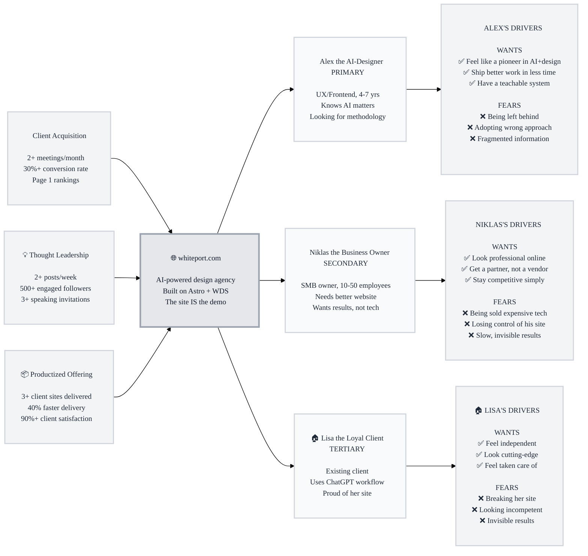

# Trigger Map Poster: Whiteport Astro

> Visual overview connecting business goals to user psychology

**Created:** 2026-03-04
**Author:** Mårten Angner / Saga
**Methodology:** Based on Effect Mapping (Balic & Domingues), adapted for WDS framework

---

## Strategic Documents

This is the visual overview. For detailed documentation, see:

- **[01-business-goals.md](01-business-goals.md)** — Full vision statements and SMART objectives
- **[02-Alex-the-AI-Designer.md](02-Alex-the-AI-Designer.md)** — Primary persona with complete driving forces
- **[03-Niklas-the-Business-Owner.md](03-Niklas-the-Business-Owner.md)** — Secondary persona
- **[04-Lisa-the-Loyal-Client.md](04-Lisa-the-Loyal-Client.md)** — Tertiary persona
- **[05-feature-impact-analysis.md](05-feature-impact-analysis.md)** — Prioritized features with impact scores

---

## Vision

_Whiteport is the name people trust when they want AI to actually work for their business — proven methodology, real results, a partner who gets it._

---

## Business Objectives

### Objective 1: Client Acquisition

- **Metric:** Discovery meetings booked per month
- **Target:** 2+ meetings/month within 6 months
- **Timeline:** Q3 2026

### Objective 2: Thought Leadership

- **Metric:** Engaged professional audience
- **Target:** 500+ followers, 2+ posts/week, 3+ speaking invitations
- **Timeline:** Q1 2027

### Objective 3: Productized Offering

- **Metric:** Client sites delivered using Astro + AI pattern
- **Target:** 3+ sites delivered, 40% faster delivery, 90%+ satisfaction
- **Timeline:** Q1 2027

---

## Target Groups (Prioritized)

### 1. Alex the AI-Curious Designer

**Priority Reasoning:** Alex is the flywheel engine. Their adoption and advocacy of WDS drives both thought leadership visibility and indirect client referrals. Every successful Alex multiplies Whiteport's reach.

> UX designer or frontend dev, 4-7 years experience, knows AI is changing everything but hasn't found a methodology that works. Tried ChatGPT, Cursor, Figma AI — all fragmented. Looking for someone who's figured out the system.

**Key Positive Drivers:**
- Feel like a pioneer — be the person who figured out AI+design before everyone else
- Ship better work in less time — actual productivity, not buzzwords
- Have a system they can explain and teach to others

**Key Negative Drivers:**
- Fear being left behind while others master AI
- Fear investing in the wrong approach (been burned by hype before)
- Frustrated by fragmented information — no coherent workflow exists

### 2. Niklas the Business Owner

**Priority Reasoning:** Niklas is the revenue engine. Direct client acquisition. But he needs Alex's content to discover Whiteport, and Lisa's referrals to trust the decision.

> SMB owner, 10-50 employees, knows his website needs work but doesn't know where to start. Heard "AI" from every direction but can't tell what's real. Wants results, not experiments.

**Key Positive Drivers:**
- Look professional online — website that matches the quality of his actual business
- Get a partner, not a vendor — someone who handles the tech and understands his business
- Stay competitive without becoming a tech company

**Key Negative Drivers:**
- Fear being sold expensive tech he doesn't need
- Fear losing control — locked into platforms he can't understand
- Frustrated by slow results — wants to see progress, not hear about "phases"

### 3. Lisa the Loyal Client

**Priority Reasoning:** Lisa is the proof and the referral channel. Her success validates the model. Her word-of-mouth is the highest-converting marketing Whiteport can have.

> Existing Whiteport client with a delivered Astro site. Not technical but capable. Updates content through ChatGPT. Proud of her modern website.

**Key Positive Drivers:**
- Feel independent — update her own site without needing a developer
- Look cutting-edge to her own clients
- Feel taken care of — know Mårten is there if something goes wrong

**Key Negative Drivers:**
- Fear breaking her site by pushing wrong content
- Fear looking incompetent when asking questions
- Frustrated by invisible results — "did it actually go live?"

---

## Trigger Map Visualization

---

## Design Focus Statement

Every design decision on whiteport.com must serve a dual purpose: **attract Alex through substance** and **convert Niklas through clarity**. The site must demonstrate methodology depth (for Alex) while never losing sight of the business owner scanning for "can this person help me?" (for Niklas).

**Primary Design Target:** Alex the AI-Curious Designer

**Must Address:**
- Prove the methodology works (the site itself is built with it)
- Show technical depth without being inaccessible
- Provide a clear path from "interesting" to "I want to try this"
- Make the booking CTA visible without being pushy

**Should Address:**
- Case studies or portfolio showing business results (for Niklas)
- Content update workflow demonstration (for Lisa)
- Clear pricing signals or "starting from" ranges (for Niklas)

---

## Cross-Group Patterns

### Shared Drivers

All three personas share a need for **proof over promises**. Alex wants to see real methodology, Niklas wants to see real results, Lisa wants to see real content going live. The site must show, not tell.

All three value **simplicity in complexity**. Alex wants a clear framework (not more tools). Niklas wants a clear service (not more jargon). Lisa wants a clear workflow (not more steps).

### Unique Drivers

- **Alex** uniquely cares about *being ahead of the curve* — the pioneer motivation
- **Niklas** uniquely cares about *the relationship* — he's hiring a person, not a technology
- **Lisa** uniquely cares about *independence* — she wants to do it herself

### Potential Tensions

- **Depth vs. Simplicity:** Alex wants technical depth. Niklas wants plain language. Solution: layer the content — summary for Niklas, detail for Alex (expandable sections, blog deep-dives)
- **Methodology vs. Results:** Alex cares about the process. Niklas cares about the outcome. Solution: show both — "here's how we work" AND "here's what clients got"

---

## Next Steps

- [x] **Review detailed docs** — Business goals, personas, driving forces documented
- [ ] **Feature Impact Analysis** — Score features against prioritized drivers
- [ ] **Guide UX Design** — Use drivers to inform page layouts and content hierarchy
- [ ] **Validate with Users** — Test assumptions with real target group members
- [ ] **Update as Learnings Emerge** — This is a living document

---

_Generated with Whiteport Design Studio framework_
_Trigger Mapping methodology credits: Effect Mapping by Mijo Balic & Ingrid Domingues (inUse), adapted with negative driving forces_
